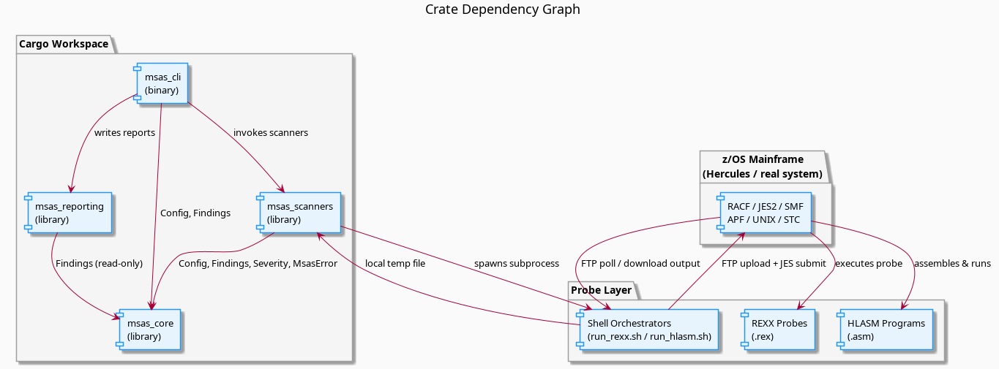
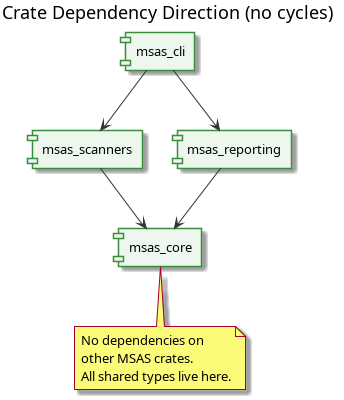

# Mainframe Security Auditing Suite

> **A concept project exploring mainframe security auditing from a modern Rust toolchain.**.

[](https://www.rust-lang.org/)

---

> This is a **personal learning and concept project**, it is not a production-grade security tool. It was built to explore the intersection of modern Rust development and z/OS internals, Nothing here should be taken as a definitive reference for mainframe security auditing, the compliance mappings are illustrative rather than authoritative. If you're auditing a real production mainframe, please use proper tooling and talk to people who know what they're doing.
> 
> That said, if you're also poking around old mainframe tech for fun, welcome, and thank you for your reading.

---

## Table of Contents

- [What This Is](#what-this-is)
- [Documentation](#documentation)
- [Architecture](#architecture)
- [Workspace Structure](#workspace-structure)
- [Scanners](#scanners)
- [Compliance Mapping](#compliance-mapping)
- [Prerequisites](#prerequisites)
- [Installation](#installation)
- [Configuration](#configuration)
- [Usage](#usage)
- [Output Formats](#output-formats)
- [Probe Delivery Pipeline](#probe-delivery-pipeline)
- [Testing](#testing)
- [Security Notes](#security-notes)

---

## What This Is

MSAS is a Rust-based tool that connects to a z/OS mainframe over FTP, uploads and executes security probe scripts (REXX and HLASM), retrieves their output, and turns it into structured security findings, complete with severity levels, compliance tags, and reports in JSON, HTML, CSV, or PDF.

It was built primarily to learn:

- How to drive z/OS JES2 job submission programmatically from a modern language
- How REXX probes can extract RACF, APF, JES2, and SMF data
- How HLASM programs can walk in-memory structures like the CVT
- How to decode CP037 EBCDIC output from a native z/OS program in Rust

The probes are written to work within constraints you would normally find in a zV1R1+ system. If you're running something way newer, things will or may work differently.

---

## Documentation

The full documentation suite lives alongside this file:

| Document           | Audience                           | What's in it                                                                                                          |
| ------------------ | ---------------------------------- | --------------------------------------------------------------------------------------------------------------------- |
| DEVELOPER_GUIDE.md | If you want to extend the codebase | How to add a new scanner, probe, or report format; the config system; error handling conventions; and common pitfalls |

If you're here for the first time, start with the README (it's this text), then DEVELOPER_GUIDE.md when you want to understand how it works.

---

## Architecture



---

## Workspace Structure

```
msas/
├── config/
│   ├── default.toml              # Mainframe connection & path defaults
│   └── compliance_mapping.toml   # Finding ID -> compliance framework mappings
│
├── crates/
│   ├── msas_core/                # Shared types, config, error, compliance
│   │   └── src/
│   │       ├── lib.rs
│   │       ├── types.rs          # Finding, Severity
│   │       ├── config.rs         # Config, MainframeConfig, PathsConfig
│   │       ├── error.rs          # Unified Error enum
│   │       └── compliance.rs     # load_mappings(), enrich_finding()
│   │
│   ├── msas_scanners/            # All nine scanner implementations
│   │   └── src/
│   │       ├── lib.rs
│   │       ├── racf.rs
│   │       ├── datasets.rs
│   │       ├── apf.rs
│   │       ├── jes.rs
│   │       ├── unix.rs
│   │       ├── stc.rs
│   │       ├── cvtwalk.rs        # CVT memory walker via HLASM
│   │       └── smf.rs
│   │
│   ├── msas_reporting/           # Report format writers
│   │   └── src/
│   │       ├── lib.rs
│   │       ├── json.rs
│   │       ├── html.rs           # Tera-templated HTML report
│   │       ├── csv.rs
│   │       └── pdf.rs
│   │
│   └── msas_cli/                 # Binary entry point (clap)
│       └── src/
│           ├── main.rs
│           └── commands/scan.rs
│
├── probes/
│   ├── rexx/                     # REXX probe scripts
│   │   ├── racf_checks.rex
│   │   ├── dataset_scan.rex
│   │   ├── apf_list.rex
│   │   ├── jes_checks.rex
│   │   ├── unix_checks.rex
│   │   ├── stc_checks.rex
│   │   └── smf_scan.rex
│   ├── hlasm/                    # HLASM assembly probes
│   │   └── cvtwalk.asm
│   └── jcl/
│       ├── RUN_REXX.jcl
│       └── RUN_HLASM.jcl
│
└── scripts/
    ├── run_demo.sh               # REXX probe orchestrator
    └── run_hlasm.sh              # HLASM probe orchestrator
```

---

## Scanners

| Scanner     | CLI Name    | Finding ID(s)                    | Probe Type   | What It Looks At              |
| ----------- | ----------- | -------------------------------- | ------------ | ----------------------------- |
| RACF        | `racf`      | `RACF-GENERIC-WARNING`           | REXX / JES2  | RACF user & resource profiles |
| Datasets    | `datasets`  | `DATASET-WEAK-PERMISSION`        | REXX / JES2  | Dataset ACLs & UACC settings  |
| APF         | `apf`       | `APF-WEAK-PERMISSION`            | REXX / JES2  | APF-authorised dataset list   |
| JES2        | `jes`       | `JES-WEAK-CONFIG`                | REXX / JES2  | Job classes, held output      |
| UNIX/USS    | `unix`      | `UNIX-WEAK-PERMISSION`           | REXX / JES2  | OMVS filesystem permissions   |
| STC         | `stc`       | `STC-WEAK-CONFIG`                | REXX / JES2  | STARTED task definitions      |
| CVT Walker  | `cvtwalk`   | `CVTWALK-*`                      | HLASM binary | In-memory CVT structure       |
| SMF         | `smf`       | `SMF-SECURITY-EVENT`, `SMF-INFO` | REXX / JES2  | SMF security event records    |

### Probe Output Protocol

All probes emit plain text using a shared prefix convention:

```
INFO:      <message>  ->  Severity::Info
WARNING:   <message>  ->  Severity::High
INSECURE:  <message>  ->  Severity::Critical
```

Lines that don't match any prefixes are silently ignored.

---

## Compliance Mapping

After scanning, findings are enriched with compliance control references from `config/compliance_mapping.toml`. These are illustrative mappings to demonstrate the concept -> not a substitute for a real compliance review.

| Finding ID                | NIST SP 800-53 | PCI-DSS | CIS   |
| ------------------------- | -------------- | ------- | ----- |
| `RACF-GENERIC-WARNING`    | AC-2           | 8.1     |       |
| `DATASET-WEAK-PERMISSION` | AC-3           |         | 1.2.3 |
| `APF-WEAK-PERMISSION`     | AC-6           | 2.2     |       |
| `JES-WEAK-CONFIG`         | AU-6           | 10.5    |       |
| `UNIX-WEAK-PERMISSION`    | AC-3           |         | 2.1.4 |
| `STC-WEAK-CONFIG`         | AC-2           | 8.5     |       |

Add your own entries to `config/compliance_mapping.toml`:

```toml
[mappings]
"MY-CUSTOM-FINDING" = ["NIST-SI-3", "CIS-5.4.1"]
```

---

## Prerequisites

| Requirement                                       | Notes                                   |
| ------------------------------------------------- | --------------------------------------- |
| Rust 1.75+                                        | Install via [rustup](https://rustup.rs) |
| `ftp` CLI on `PATH`                               | Any POSIX `ftp` works                   |
| z/OS target                                       | newer versions should be fine           |
| HLASM (on z/OS)                                   | Only needed for `cvtwalk` scanners      |
| [Hercules emulator](http://www.hercules-390.org/) | For local testing without real iron     |

---

## Installation

```bash
git clone https://github.com/czeti/msas.git
cd msas
cargo build --release
```

---

## Configuration

Edit `config/default.toml` to match your environment:

```toml
[mainframe]
host = "192.168.8.210"
user = "IBMUSER"
pass = "SYS1"

[paths]
rexx_pds = "IBMUSER.PROBES.REXX"
output_dsn = "IBMUSER.MSAS.OUTPUT"
local_output = "/tmp/test_output.txt" # assumes linux fs, caller would have to compensate
```

Override the password without touching the file:

```bash
export MAINFRAME_PASSWORD="your_password"
```

---

## Usage

```bash
# Run all scanners
msas_cli

# Run specific scanners
msas_cli racf datasets apf

# Run in parallel and produce all report formats
msas_cli --jobs 4 \
         --output-json  findings.json \
         --output-html  report.html   \
         --output-csv   report.csv    \
         --output-pdf   report.pdf

# Use a custom config file
msas_cli --config /path/to/config.toml racf
```

Available scanner names: `racf` `datasets` `apf` `jes` `unix` `stc` `apf_hlasm` `cvtwalk` `smf`

---
## Output Formats

**JSON**: pretty-printed array of finding objects including compliance tags.

**HTML**: self-contained report with severity colour-coding, compliance badges, and a summary grid. Generated with [Tera](https://keats.github.io/tera/).

**CSV**: flat table: `id, title, severity, affected_resource, remediation, compliance`. Multiple compliance IDs are joined with `;` .

**PDF**: executive summary on page 1, detailed findings on subsequent pages. Generated with [printpdf](https://github.com/fschutt/printpdf).

---

## Probe Delivery Pipeline




The HLASM pipeline additionally assembles and links a native z/OS program and retrieves its output as raw binary.

---

## Testing

```bash
# Offline unit tests (no mainframe needed)
cargo test

# Full integration tests against Hercules/z/OS
RUN_HERCULES_TEST=1 cargo test
```

Integration tests are gated behind `RUN_HERCULES_TEST=1` so they never fire unexpectedly.

If you're looking to add a new scanner, probe, or report format, see **DEVELOPER_GUIDE.md** for the full extension guide and common pitfalls.

---

## Security Notes

Since this targets a local Hercules setup, the defaults (plain FTP, `IBMUSER`/`SYS1`) are perfectly fine for experimentation. In practice, use `MAINFRAME_PASSWORD` instead of hardcoding credentials, restrict FTP to internal networks, and use a dedicated low-privilege auditing account rather than a superuser ID.
