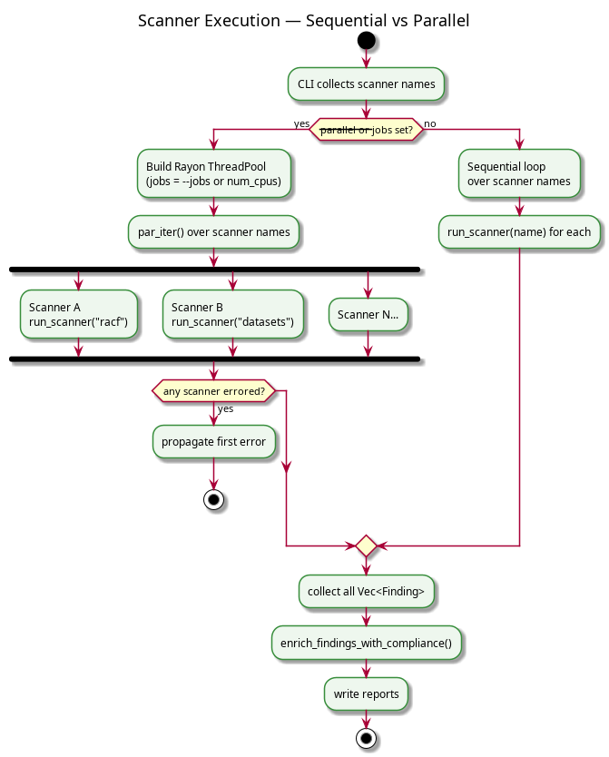

# MSAS Developer Guide

This guide assumes you're comfortable with Rust, and have at least a passing familiarity with z/OS concepts.

---

## Table of Contents

- [Crate Overview](#crate-overview)
- [Core Types](#core-types)
- [Adding a New Scanner](#adding-a-new-scanner)
- [Adding a New Probe](#adding-a-new-probe)
- [Adding a New Report Format](#adding-a-new-report-format)
- [Compliance Mappings](#compliance-mappings)
- [Scanner Execution Model](#scanner-execution-model)
- [EBCDIC Decoding](#ebcdic-decoding)
- [Configuration System](#configuration-system)
- [MsasError Handling](#error-handling)
- [Testing](#testing)
- [Common Pitfalls](#common-pitfalls)

---

## Crate Overview

The workspace is split into four crates with strict dependency directions:


|Crate|Type|Responsibility|
|---|---|---|
|`msas_core`|lib|`Findings`, `Severity`, `Config`, `MsasError`, compliance enrichment|
|`msas_scanners`|lib|One module per scanner; all probe execution logic|
|`msas_reporting`|lib|One module per output format|
|`msas_cli`|bin|CLI parsing (`clap`), wires scanners to reporters|

---

## Core Types

Everything flows through two types defined in `msas_core::types`:

```rust
pub enum Severity {
    Info,
    Low,
    Medium,
    High,
    Critical,
}

pub struct Findings {
    pub id:                String,
    pub title:             String,
    pub severity:          Severity,
    pub affected_resource: String,
    pub remediation:       String,
    pub compliance:        Option<Vec<String>>,  // populated after scanning
}
```

`Findings.compliance` is always `None` when a scanner produces it. The `enrich_findings_with_compliance()` function in `msas_cli/commands/scan.rs` populates it after all scanners complete, by looking up `Findings.id` in the TOML mapping.

`Severity` derives `PartialOrd + Ord`, so findings can be sorted severity if needed.

---

## Adding a New Scanner

The pattern is identical across all nine existing scanners. Here's the minimal template:

### 1. Create the scanner module

Create `crates/msas_scanners/src/my_scanner.rs`:

```rust
use msas_core::{Config, MsasError, Findings, Severity};
use std::{env, fs, path::{Path, PathBuf}, process::{Command, Stdio}};

pub fn scan_my_scanner_with_config(config: &Config) -> Result<Vec<Findings>, MsasError> {
    run_scan(config.clone())
}

pub fn scan_my_scanner() -> Result<Vec<Findings>, MsasError> {
    run_scan(Config::default()?)
}

fn run_scan(config: Config) -> Result<Vec<Findings>, MsasError> {
    let root = workspace_root()?;
    let script = root.join("scripts/run_rexx.sh");

    if !script.exists() {
        return Err(MsasError::Other(format!("Script not found: {:?}", script)));
    }

    let output_path = build_output_path(&config);

    let status = Command::new(&script)
        .current_dir(&root)
        .arg("my_probe_name")
        .env("MF_HOST", &config.mainframe.host)
        .env("MF_USER", &config.mainframe.user)
        .env("MF_PASS", &config.mainframe.password)
        .env("REXX_PDS", &config.paths.rexx_pds)
        .env("OUTPUT_DSN", &config.paths.output_dataset)
        .env("LOCAL_OUTPUT", &output_path)
        .stdout(Stdio::null())
        .stderr(Stdio::null())
        .status()
        .map_err(MsasError::Io)?;

    if !status.success() {
        return Err(MsasError::ScriptFailed(format!("Script exited with: {}", status)));
    }

    let contents = fs::read_to_string(&output_path)?;
    parse_output(&contents)
}

fn workspace_root() -> Result<PathBuf, MsasError> {
    let dir = env::var("CARGO_MANIFEST_DIR")
        .map_err(|_| MsasError::Other("CARGO_MANIFEST_DIR not set".into()))?;

    Path::new(&dir)
        .parent()
        .and_then(|p| p.parent())
        .map(|p| p.to_path_buf())
        .ok_or_else(|| MsasError::Other("Could not determine workspace root".into()))
}

fn build_output_path(config: &Config) -> String {
    let base = Path::new(&config.paths.local_output);
    let dir = base.parent().unwrap_or(Path::new("test_output"));
    format!("{}/my_scanner_{}.txt", dir.display(), std::process::id())
}

pub fn parse_output(contents: &str) -> Result<Vec<Findings>, MsasError> {
    let mut results = Vec::new();

    for line in contents.lines().map(str::trim) {
        let parsed = parse_line(line);
        if let Some((severity, resource)) = parsed {
            results.push(Findings {
                id: "MY-FINDING-ID".to_string(),
                title: line.to_string(),
                severity,
                affected_resource: resource,
                remediation: "Describe the fix here".to_string(),
                compliance: None,
            });
        }
    }

    Ok(results)
}

fn parse_line(line: &str) -> Option<(Severity, String)> {
    let (severity, rest) = if let Some(r) = line.strip_prefix("WARNING:") {
        (Severity::High, r)
    } else if let Some(r) = line.strip_prefix("INSECURE:") {
        (Severity::Critical, r)
    } else if let Some(r) = line.strip_prefix("INFO:") {
        (Severity::Info, r)
    } else {
        return None;
    };

    let resource = rest.trim().split_whitespace().next().unwrap_or("unknown");

    Some((severity, resource.to_string()))
}
```

### 2. Export it from the scanners crate

In `crates/msas_scanners/src/lib.rs`, add:

```rust
pub mod my_scanner;
```

### 3. Register it in the CLI dispatcher

In `crates/msas_cli/src/commands/scan.rs`, add a match arm:

```rust
"my_scanner" => my_scanner::scan_my_scanner_with_config(config)?,
```

And add `"my_scanner".to_string()` to the default scanner list in `main.rs` if it should run by default.

### 4. Add a compliance mapping (optional)

In `config/compliance_mapping.toml`:

```toml
"MY-FINDING-ID" = ["NIST-AC-2", "PCI-8.1"]
```

### 5. Write a test

Create `crates/msas_scanners/tests/test_my_scanner.rs`:

```rust
use msas_scanners::my_scanner::parse_output;

#[test]
fn test_parse_my_scanner_output() {
    let sample = r#"
INFO: Something informational
WARNING: Something concerning
INSECURE: Something critical
"#;
    let findings = parse_output(sample).unwrap();
    assert_eq!(findings.len(), 3);
    assert_eq!(findings[0].severity, msas_core::Severity::Info);
    assert_eq!(findings[1].severity, msas_core::Severity::High);
    assert_eq!(findings[2].severity, msas_core::Severity::Critical);
}
```

---

## Adding a New Probe

### REXX probe

Create `probes/rexx/my_probe_name.rex`. The probe must write its output to the dataset referenced by `OUTPUT_DSN` in the JCL. Use the existing probes as a template, they all follow the same `INFO:` / `WARNING:` / `INSECURE:` prefix convention.

The shell script (`run_rexx.sh`) derives the MVS member name by uppercasing your probe name and stripping underscores/hyphens, so `my_probe_name` becomes member `MYPROBENA`.

### HLASM probe

Create `probes/hlasm/my_probe.asm`. Use `run_hlasm.sh` as the orchestrator instead of `run_rexx.sh`. The HLASM scanner template differs slightly; see `cvtwalk.rs` for the pattern.

### JCL templates

The JCL templates in `probes/jcl/` use two substitution tokens:

|Token|Replaced with|
|---|---|
|`%MEMBER%`|Uppercased probe name (≤8 chars)|
|`%OUTPUT_DSN%`|Fully-qualified output dataset name (with PID suffix)|

The shell scripts perform this substitution with `sed` before submitting via `FILETYPE=JES`.

---

## Adding a New Report Format

All reporters live in `crates/msas_reporting/src/`. They all take `&[Findings]` and a writer implementing `Write`.

### 1. Create the module

```rust
// crates/msas_reporting/src/myformat.rs
use msas_core::Findings;
use std::io::Write;

pub fn write_myformat_report<W: Write>(
    findings: &[Findings],
    mut writer: W,
) -> Result<(), Box<dyn std::error::Error>> {
    // your implementation here
    Ok(())
}
```

### 2. Export it

In `crates/msas_reporting/src/lib.rs`:

```rust
pub mod myformat;
```

### 3. Wire it to the CLI

In `main.rs`, add an `--output-myformat` argument to the `Cli` struct and a corresponding write block following the same pattern as the existing four formats.

---

## Compliance Mappings

The compliance system is simple. `msas_core::compliance` does two things:

- `load_mappings(path)`: parses the TOML file into a `HashMap<String, Vec<String>>`
- `enrich_finding(finding, mappings)`: looks up `finding.id` and sets `finding.compliance`

Enrichment happens once in `scan.rs` after all scanners complete, so individual scanners never need to think about it. If a finding ID has no mapping entry, `compliance` stays `None` this doesn't cause an error.

---

## Scanner Execution Model



Each `run_scanner()` call:

1. Spawns a shell subprocess (blocking, `Command::status()`)
2. Reads the local temp file written by the shell script
3. Deletes the temp file
4. Calls `parse_output()`

The temp file name includes the process ID to avoid collisions when running in parallel.

---

## Configuration System

`Config::from_file(path)` parses a TOML file and then checks for `MSAS_MAINFRAME_PASSWORD`. `Config::default()` is a convenience wrapper that resolves `config/default.toml` relative to the workspace root using `CARGO_MANIFEST_DIR`.

The workspace root is derived by going two levels up from `CARGO_MANIFEST_DIR` (the crate directory → workspace root):

```
CARGO_MANIFEST_DIR = /path/to/msas/crates/msas_scanners
parent             = /path/to/msas/crates
parent.parent      = /path/to/msas   <- workspace root
```

This means `CARGO_MANIFEST_DIR` must be set, which is guaranteed during `cargo test` and `cargo run`, but **not** when running a pre-built binary directly. If you're distributing the binary, pass `--config` explicitly or set `CARGO_MANIFEST_DIR` in the environment.

---

## MsasError Handling

`msas_core::MsasError` is a plain enum:

```rust
pub enum MsasError {
    Io(std::io::MsasError),
    Parse(String),
    Ftp(String),
    ScriptFailed(String),
    Other(String),
}
```

Scanner functions return `Result<Vec<Findings>, MsasError>`. The CLI uses `anyhow` to wrap these for user-friendly error messages. Reporters return `Result<(), Box<dyn std::error::Error>>` since they use third-party crates with their own error types.

If you add a scanner, use `MsasError::ScriptFailed` for non-zero exit codes, `MsasError::Io` (via `From<std::io::Error>`) for file operations, and `MsasError::Parse` for anything that goes wrong while interpreting probe output.

---

## Testing

### Offline unit tests

Every scanner has a `test_parse_*` test that feeds a hardcoded string to `parse_output()` and asserts on the result. These are the most valuable tests; write one for every probe output pattern you handle.

```bash
cargo test                         # run all offline tests
cargo test --package msas_scanners # run scanner tests only
cargo test test_parse_racf         # run a specific test
```

### Integration tests

Gated behind `RUN_HERCULES_TEST=1`. These actually connect to the mainframe:

```bash
RUN_HERCULES_TEST=1 cargo test
```

Keep these tests permissive, assert that the scanner ran and returned at least one finding, not that it found specific security issues. The state of a Hercules test system varies.

### CLI tests

The `msas_cli` tests use `assert_cmd`. Offline tests cover argument validation. The Hercules-gated tests cover full scan → report pipelines.

```bash
cargo test --package msas_cli
```

---

## Common Pitfalls

**`CARGO_MANIFEST_DIR` not set when running the binary directly**

All config and path resolution uses `CARGO_MANIFEST_DIR`. When running `./target/release/msas_cli`, this variable isn't set by the shell. Either use `--config` to pass an explicit config path, or wrap the binary in a script that sets the variable.

**MVS member name truncation**

`run_rexx.sh` derives the member name from the probe argument by uppercasing, stripping `_` and `-`, and taking the first 8 characters. `my_long_probe_name` becomes `MYLONGPR`. Note that if two probes produce the same 8-character prefix, they'll overwrite each other in the PDS. The caller is advised to keep probe names short and unique.

**FTP `EXCLUSIVE use` / `SPFEDIT` lock**

If a PDS member is open in an SPF editor session on the mainframe, FTP will fail to upload with an `EXCLUSIVE use` error. The shell script looks for a positive `Transfer completed` confirmation rather than the absence of error strings as SPFEDIT lock messages don't use 4xx/5xx response codes. Close the member in the editor and retry.

**Parallel tests trampling each other**

Cargo runs tests in parallel by default. Each scanner appends its process ID to the output file name (`racf_12345.txt`) and to the MVS output dataset name (`.Pnnnnn` suffix) to avoid collisions. If you're seeing intermittent failures in integration tests, check whether the PID suffix is being applied correctly in your new scanner.

**HLASM Return Code 8+**

`run_hlasm.sh` checks the `Return Code` line in the HLASM listing. A return code of 8 or higher means assembly errors. The listing file is printed to stdout before the script exits with an error, so you'll see exactly which statements failed. On z/OS 1.10, some macros available in later releases don't exist, check the listing for `MNOTE` and `ERROR` lines.

**`compliance` field is `null` in output**

This means the finding's `id` has no entry in `config/compliance_mapping.toml`. It's not an error because the field is `Option<Vec<String>>`. Add the mapping if you want it populated.
